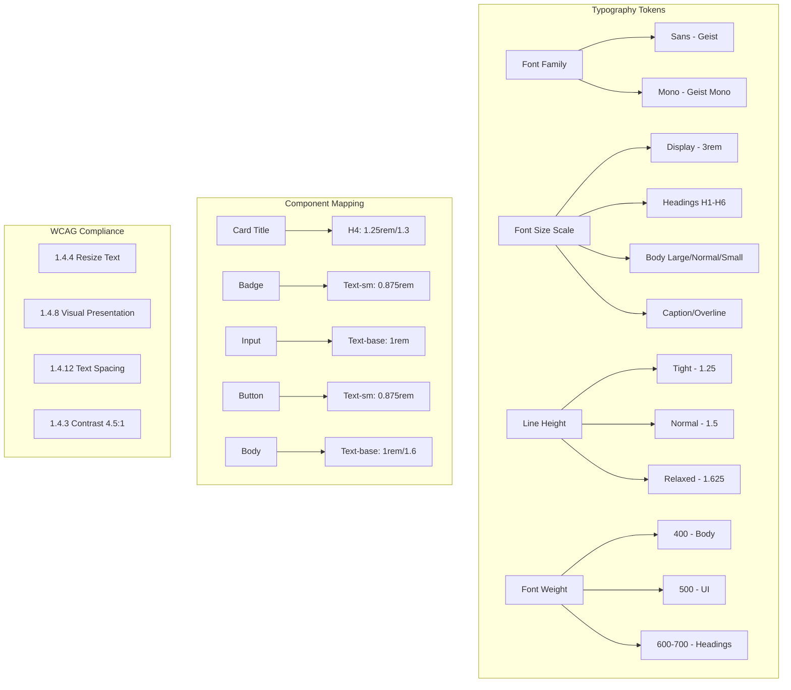

# WCAG 2.1 AA Typography System Specification

## Overview

This document defines a comprehensive, WCAG 2.1 AA compliant typography system for the Next.js e-commerce application. It addresses identified legibility issues and establishes consistent typographic patterns across all components.

### Current Issues Addressed

| Issue | Location | Current Value | Problem | Solution |
|-------|----------|---------------|---------|----------|
| Card title line-height | `card.tsx:35` | `leading-none` (1.0) | Too tight for readability | `leading-tight` (1.25) |
| Badge font size | `badge.tsx:8` | `text-xs` (12px) | Too small for eCommerce | `text-sm` (14px) minimum |
| Input mobile font size | `input.tsx:11` | `text-base` → `md:text-sm` | iOS zoom on focus | `text-base` (16px) always |
| Label line-height | `label.tsx:16` | `leading-none` (1.0) | Poor readability | `leading-normal` (1.5) |
| No type scale | `globals.css` | Missing CSS variables | Inconsistent sizing | Complete CSS variable system |

---

## 1. Typography Philosophy & Principles

### 1.1 Legibility First Approach

The typography system prioritizes readability and accessibility over aesthetic minimalism:

- **Sufficient line height**: Never use `leading-none` for content text; minimum 1.5 for body text
- **Adequate font sizes**: Minimum 14px (0.875rem) for UI elements, 16px (1rem) for inputs
- **Proper contrast**: Combined with WCAG 2.1 AA color system (4.5:1 minimum)
- **Generous spacing**: Letter spacing adjusted for small text to improve legibility

### 1.2 WCAG 2.1 Text Spacing Requirements (Level AAA - 1.4.8, 1.4.12)

The system must support these user-adjusted spacing values without content loss:

| Property | Minimum Requirement | Our Implementation |
|----------|-------------------|-------------------|
| Line height | 1.5 × font size | ✅ Minimum 1.5 for body |
| Spacing after paragraphs | 2 × font size | ✅ Built into spacing scale |
| Letter spacing | 0.12 × font size | ✅ Supported via variables |
| Word spacing | 0.16 × font size | ✅ Supported via variables |

### 1.3 Mobile-First Considerations

**Critical: iOS Input Zoom Prevention**

iOS Safari automatically zooms in on input fields with font sizes smaller than 16px. To prevent this:

- All input fields MUST use `text-base` (16px) or larger
- No `text-sm` on mobile inputs
- Use `text-base` consistently, scale up if needed

---

## 2. Type Scale Definition

### 2.1 Complete Type Scale

All sizes defined in rem (with px equivalent for reference) for proper scaling:

| Token | Size (rem) | Size (px) | Line Height | Letter Spacing | Weight | Use Case |
|-------|-----------|-----------|-------------|----------------|--------|----------|
| `--font-size-display` | 3rem | 48px | 1.1 | -0.02em | 700 | Hero banners, major headlines |
| `--font-size-h1` | 2.25rem | 36px | 1.2 | -0.02em | 700 | Page titles |
| `--font-size-h2` | 1.875rem | 30px | 1.2 | -0.015em | 600 | Section headings |
| `--font-size-h3` | 1.5rem | 24px | 1.25 | -0.01em | 600 | Subsection headings |
| `--font-size-h4` | 1.25rem | 20px | 1.3 | -0.005em | 600 | Card titles |
| `--font-size-h5` | 1.125rem | 18px | 1.35 | 0 | 600 | Small headings |
| `--font-size-h6` | 1rem | 16px | 1.4 | 0 | 600 | Labels, micro-headings |
| `--font-size-body-lg` | 1.125rem | 18px | 1.6 | 0 | 400 | Lead paragraphs |
| `--font-size-body` | 1rem | 16px | 1.6 | 0 | 400 | Body text (default) |
| `--font-size-body-sm` | 0.875rem | 14px | 1.5 | 0.01em | 400 | Secondary text |
| `--font-size-caption` | 0.75rem | 12px | 1.4 | 0.02em | 400 | Fine print, legal text |
| `--font-size-overline` | 0.75rem | 12px | 1.4 | 0.08em | 500 | Category labels, uppercase |

### 2.2 Typography Token Reference

```
Type Scale Visualization (mobile base):

Display  ████████████████████████████████████████████████████████████████  48px/1.1
H1       ██████████████████████████████████████████████████              36px/1.2
H2       ████████████████████████████████████████                          30px/1.2
H3       ██████████████████████████████                                    24px/1.25
H4       █████████████████████████                                         20px/1.3
H5       ██████████████████████                                            18px/1.35
H6       ██████████████████                                                16px/1.4
Body Lg  ██████████████████████                                            18px/1.6
Body     ██████████████████                                                16px/1.6
Body Sm  █████████████████                                                 14px/1.5
Caption  ██████████████                                                    12px/1.4
Overline ██████████████                                                    12px/1.4
```

---

## 3. Line Height Guidelines

### 3.1 WCAG 1.4.8 Visual Presentation Compliance

Per WCAG Level AAA guidelines for visual presentation:

| Element Type | Minimum Line Height | Recommended | Usage |
|--------------|-------------------|-------------|-------|
| **Display/Hero** | 1.1 | 1.1-1.15 | Large promotional text |
| **Headings (H1-H3)** | 1.2 | 1.2-1.25 | Section headers |
| **Headings (H4-H6)** | 1.25 | 1.3-1.4 | Sub-headings, card titles |
| **Body Text** | **1.5** | 1.6 | Paragraphs, descriptions |
| **UI Elements** | 1.25 | 1.5 | Buttons, labels, navigation |
| **Badges/Tags** | 1.25 | 1.25-1.4 | Compact inline elements |

### 3.2 Line Height CSS Variables

```css
--line-height-none: 1;
--line-height-tight: 1.25;    /* Headings, compact UI */
--line-height-snug: 1.375;    /* Subheadings */
--line-height-normal: 1.5;    /* Minimum for body text (WCAG) */
--line-height-relaxed: 1.625; /* Comfortable reading */
--line-height-loose: 2;       /* Generous spacing */
```

---

## 4. Font Weight Guidelines

### 4.1 Weight Scale

| Token | Value | Usage | Example |
|-------|-------|-------|---------|
| `--font-weight-light` | 300 | Large display text | Hero headlines |
| `--font-weight-normal` | 400 | Body text | Product descriptions |
| `--font-weight-medium` | 500 | UI elements, emphasis | Buttons, navigation |
| `--font-weight-semibold` | 600 | Headings, active states | Card titles, H2-H6 |
| `--font-weight-bold` | 700 | Strong emphasis, H1 | Page titles, prices |
| `--font-weight-black` | 900 | Maximum emphasis | Sale badges, warnings |

### 4.2 Weight by Element Type

| Element | Font Weight | Rationale |
|---------|-------------|-----------|
| **Body text** | 400 (normal) | Optimal reading experience |
| **Headings** | 600-700 (semibold-bold) | Visual hierarchy |
| **Buttons** | 500 (medium) | Actionable appearance |
| **Labels** | 500 (medium) | Clarity without heaviness |
| **Navigation** | 500-600 | Active state differentiation |
| **Prices** | 700 (bold) | Attention and importance |

---

## 5. Component-Specific Typography

### 5.1 Button Typography

| Size Variant | Font Size | Line Height | Weight | Letter Spacing |
|--------------|-----------|-------------|--------|----------------|
| xs | 0.75rem (12px) | 1rem (16px) | 500 | 0.01em |
| sm | 0.875rem (14px) | 1.25rem (20px) | 500 | 0.01em |
| default | 0.875rem (14px) | 1.25rem (20px) | 500 | 0.01em |
| lg | 1rem (16px) | 1.5rem (24px) | 500 | 0em |

**Implementation:**
```tsx
// Button sizes now include proper typography
const buttonVariants = cva(
  "inline-flex items-center justify-center gap-2 whitespace-nowrap rounded-md font-medium transition-all",
  {
    variants: {
      size: {
        xs: "h-6 gap-1 rounded-md px-2 text-xs font-medium tracking-wide leading-4",
        sm: "h-8 gap-1.5 rounded-md px-3 text-sm font-medium tracking-wide leading-5",
        default: "h-9 px-4 py-2 text-sm font-medium tracking-wide leading-5",
        lg: "h-10 rounded-md px-6 text-base font-medium leading-6",
      },
    },
  }
);
```

### 5.2 Card Typography

| Element | Font Size | Line Height | Weight | Letter Spacing |
|---------|-----------|-------------|--------|----------------|
| **Card Title** | 1.25rem (20px) | 1.3 (1.4rem) | 600 | -0.005em |
| **Card Description** | 0.875rem (14px) | 1.5 (21px) | 400 | 0.01em |
| **Card Meta** | 0.75rem (12px) | 1.4 (16.8px) | 400 | 0.02em |

**Fixed Implementation:**
```tsx
// BEFORE (problematic)
function CardTitle({ className, ...props }) {
  return (
    <div
      className={cn("leading-none font-semibold", className)} // ❌ leading-none too tight
      {...props}
    />
  );
}

// AFTER (accessible)
function CardTitle({ className, ...props }) {
  return (
    <div
      className={cn(
        "text-xl font-semibold leading-tight tracking-tight", // ✅ 1.25 line height
        className
      )}
      {...props}
    />
  );
}
```

### 5.3 Badge Typography

| Variant | Font Size | Line Height | Weight | Notes |
|---------|-----------|-------------|--------|-------|
| **Default** | 0.875rem (14px) | 1.25rem (20px) | 500 | Minimum size for eCommerce |
| **Large** | 1rem (16px) | 1.5rem (24px) | 500 | Prominent badges |
| **Small** | 0.75rem (12px) | 1rem (16px) | 500 | Only for non-critical info |

**Fixed Implementation:**
```tsx
// BEFORE (too small)
const badgeVariants = cva(
  "inline-flex items-center justify-center rounded-full border px-2 py-0.5 text-xs font-medium" // ❌ text-xs = 12px
);

// AFTER (accessible)
const badgeVariants = cva(
  "inline-flex items-center justify-center rounded-full border px-2.5 py-1 text-sm font-medium leading-5 tracking-wide" // ✅ text-sm = 14px
);
```

### 5.4 Input/Label Typography

**CRITICAL: iOS Zoom Prevention**

| Element | Mobile (<640px) | Tablet (640px+) | Desktop (1024px+) |
|---------|-----------------|-----------------|-------------------|
| **Input text** | 1rem (16px) | 1rem (16px) | 1rem (16px) |
| **Label** | 0.875rem (14px) | 0.875rem (14px) | 0.875rem (14px) |
| **Helper text** | 0.875rem (14px) | 0.875rem (14px) | 0.875rem (14px) |
| **Error text** | 0.875rem (14px) | 0.875rem (14px) | 0.875rem (14px) |

**Fixed Implementation:**
```tsx
// BEFORE (causes iOS zoom)
function Input({ className, type, ...props }) {
  return (
    <input
      className={cn(
        "text-base md:text-sm", // ❌ zooms on mobile iOS
        className
      )}
      {...props}
    />
  );
}

// AFTER (no zoom)
function Input({ className, type, ...props }) {
  return (
    <input
      className={cn(
        "text-base leading-normal", // ✅ always 16px, no zoom
        className
      )}
      {...props}
    />
  );
}
```

### 5.5 Product Card Typography

| Element | Font Size | Line Height | Weight | Letter Spacing |
|---------|-----------|-------------|--------|----------------|
| **Product Name** | 1rem (16px) | 1.4 | 500 | 0 |
| **Product Name (compact)** | 0.875rem (14px) | 1.4 | 500 | 0 |
| **Price (current)** | 1.125rem (18px) | 1.3 | 700 | -0.01em |
| **Price (original)** | 0.875rem (14px) | 1.3 | 400 | 0.01em |
| **Rating value** | 0.875rem (14px) | 1 | 500 | 0 |
| **Review count** | 0.75rem (12px) | 1.4 | 400 | 0.02em |
| **Description** | 0.875rem (14px) | 1.5 | 400 | 0.01em |

### 5.6 Navigation Typography

| Element | Font Size | Line Height | Weight (inactive) | Weight (active) |
|---------|-----------|-------------|-------------------|-----------------|
| **Primary nav** | 0.875rem (14px) | 1.5 | 500 | 600 |
| **Secondary nav** | 0.875rem (14px) | 1.5 | 400 | 500 |
| **Breadcrumbs** | 0.875rem (14px) | 1.5 | 400 | 500 |
| **Footer links** | 0.875rem (14px) | 1.5 | 400 | 500 |

---

## 6. Responsive Typography

### 6.1 Fluid Type Scale

The type scale adjusts at defined breakpoints for optimal reading across devices:

| Token | Mobile (<640px) | Tablet (640-1024px) | Desktop (>1024px) |
|-------|-----------------|---------------------|-------------------|
| `--font-size-display` | 2.25rem (36px) | 2.5rem (40px) | 3rem (48px) |
| `--font-size-h1` | 1.875rem (30px) | 2rem (32px) | 2.25rem (36px) |
| `--font-size-h2` | 1.5rem (24px) | 1.625rem (26px) | 1.875rem (30px) |
| `--font-size-h3` | 1.25rem (20px) | 1.375rem (22px) | 1.5rem (24px) |
| `--font-size-h4` | 1.125rem (18px) | 1.125rem (18px) | 1.25rem (20px) |
| `--font-size-h5` | 1rem (16px) | 1rem (16px) | 1.125rem (18px) |
| `--font-size-h6` | 0.875rem (14px) | 0.875rem (14px) | 1rem (16px) |

### 6.2 Responsive Implementation

```css
/* Mobile-first base styles */
:root {
  --font-size-display: 2.25rem;
  --font-size-h1: 1.875rem;
  --font-size-h2: 1.5rem;
  --font-size-h3: 1.25rem;
  --font-size-h4: 1.125rem;
  --font-size-h5: 1rem;
  --font-size-h6: 0.875rem;
}

/* Tablet breakpoint */
@media (min-width: 640px) {
  :root {
    --font-size-display: 2.5rem;
    --font-size-h1: 2rem;
    --font-size-h2: 1.625rem;
    --font-size-h3: 1.375rem;
  }
}

/* Desktop breakpoint */
@media (min-width: 1024px) {
  :root {
    --font-size-display: 3rem;
    --font-size-h1: 2.25rem;
    --font-size-h2: 1.875rem;
    --font-size-h3: 1.5rem;
    --font-size-h4: 1.25rem;
    --font-size-h5: 1.125rem;
    --font-size-h6: 1rem;
  }
}
```

### 6.3 Tailwind Config Integration

```typescript
// tailwind.config.ts additions
{
  theme: {
    fontSize: {
      'display': ['var(--font-size-display)', { lineHeight: 'var(--line-height-tight)', letterSpacing: 'var(--letter-spacing-tight)' }],
      'h1': ['var(--font-size-h1)', { lineHeight: 'var(--line-height-tight)', letterSpacing: 'var(--letter-spacing-tight)' }],
      'h2': ['var(--font-size-h2)', { lineHeight: 'var(--line-height-tight)', letterSpacing: 'var(--letter-spacing-tight)' }],
      'h3': ['var(--font-size-h3)', { lineHeight: 'var(--line-height-snug)', letterSpacing: 'var(--letter-spacing-snug)' }],
      'h4': ['var(--font-size-h4)', { lineHeight: 'var(--line-height-snug)', letterSpacing: 'var(--letter-spacing-snug)' }],
      'h5': ['var(--font-size-h5)', { lineHeight: 'var(--line-height-normal)', letterSpacing: 'var(--letter-spacing-normal)' }],
      'h6': ['var(--font-size-h6)', { lineHeight: 'var(--line-height-normal)', letterSpacing: 'var(--letter-spacing-normal)' }],
    },
  },
}
```

---

## 7. CSS Custom Properties

### 7.1 Complete Typography Variables

Add these to `src/app/globals.css`:

```css
/**
 * Typography System Variables
 * WCAG 2.1 AA Compliant
 */

:root {
  /* ========================================
     FONT FAMILY
     ======================================== */
  --font-sans: var(--font-geist-sans), ui-sans-serif, system-ui, sans-serif;
  --font-mono: var(--font-geist-mono), ui-monospace, monospace;

  /* ========================================
     FONT SIZE SCALE
     ======================================== */
  /* Mobile-first base sizes */
  --font-size-display: 2.25rem;    /* 36px - Hero */
  --font-size-h1: 1.875rem;        /* 30px - Page title */
  --font-size-h2: 1.5rem;          /* 24px - Section heading */
  --font-size-h3: 1.25rem;         /* 20px - Subsection */
  --font-size-h4: 1.125rem;        /* 18px - Card title */
  --font-size-h5: 1rem;            /* 16px - Small heading */
  --font-size-h6: 0.875rem;        /* 14px - Label heading */
  
  /* Body sizes */
  --font-size-body-lg: 1.125rem;   /* 18px - Lead text */
  --font-size-body: 1rem;          /* 16px - Body text */
  --font-size-body-sm: 0.875rem;   /* 14px - Secondary text */
  --font-size-caption: 0.75rem;    /* 12px - Fine print */
  --font-size-overline: 0.75rem;   /* 12px - Category label */

  /* ========================================
     LINE HEIGHT SCALE
     ======================================== */
  --line-height-none: 1;           /* Headlines, tight UI */
  --line-height-tight: 1.25;       /* Headings, compact */
  --line-height-snug: 1.375;       /* Subheadings */
  --line-height-normal: 1.5;       /* Body text minimum (WCAG) */
  --line-height-relaxed: 1.625;    /* Comfortable reading */
  --line-height-loose: 2;          /* Generous spacing */

  /* ========================================
     FONT WEIGHT SCALE
     ======================================== */
  --font-weight-light: 300;
  --font-weight-normal: 400;
  --font-weight-medium: 500;
  --font-weight-semibold: 600;
  --font-weight-bold: 700;
  --font-weight-black: 900;

  /* ========================================
     LETTER SPACING SCALE
     ======================================== */
  --letter-spacing-tighter: -0.02em;
  --letter-spacing-tight: -0.01em;
  --letter-spacing-normal: 0;
  --letter-spacing-wide: 0.01em;
  --letter-spacing-wider: 0.02em;
  --letter-spacing-widest: 0.08em;
}

/* ========================================
   RESPONSIVE TYPE SCALE
   ======================================== */

/* Tablet breakpoint */
@media (min-width: 640px) {
  :root {
    --font-size-display: 2.5rem;   /* 40px */
    --font-size-h1: 2rem;          /* 32px */
    --font-size-h2: 1.625rem;      /* 26px */
    --font-size-h3: 1.375rem;      /* 22px */
  }
}

/* Desktop breakpoint */
@media (min-width: 1024px) {
  :root {
    --font-size-display: 3rem;     /* 48px */
    --font-size-h1: 2.25rem;       /* 36px */
    --font-size-h2: 1.875rem;      /* 30px */
    --font-size-h3: 1.5rem;        /* 24px */
    --font-size-h4: 1.25rem;       /* 20px */
    --font-size-h5: 1.125rem;      /* 18px */
    --font-size-h6: 1rem;          /* 16px */
  }
}
```

### 7.2 Theme Integration

Update the `@theme inline` block in `src/app/globals.css`:

```css
@theme inline {
  /* Existing color variables... */
  
  /* Typography - Font Sizes */
  --font-size-display: var(--font-size-display);
  --font-size-h1: var(--font-size-h1);
  --font-size-h2: var(--font-size-h2);
  --font-size-h3: var(--font-size-h3);
  --font-size-h4: var(--font-size-h4);
  --font-size-h5: var(--font-size-h5);
  --font-size-h6: var(--font-size-h6);
  --font-size-body-lg: var(--font-size-body-lg);
  --font-size-body: var(--font-size-body);
  --font-size-body-sm: var(--font-size-body-sm);
  --font-size-caption: var(--font-size-caption);
  --font-size-overline: var(--font-size-overline);
  
  /* Typography - Line Heights */
  --line-height-none: var(--line-height-none);
  --line-height-tight: var(--line-height-tight);
  --line-height-snug: var(--line-height-snug);
  --line-height-normal: var(--line-height-normal);
  --line-height-relaxed: var(--line-height-relaxed);
  --line-height-loose: var(--line-height-loose);
  
  /* Typography - Font Weights */
  --font-weight-light: var(--font-weight-light);
  --font-weight-normal: var(--font-weight-normal);
  --font-weight-medium: var(--font-weight-medium);
  --font-weight-semibold: var(--font-weight-semibold);
  --font-weight-bold: var(--font-weight-bold);
  --font-weight-black: var(--font-weight-black);
  
  /* Typography - Letter Spacing */
  --letter-spacing-tighter: var(--letter-spacing-tighter);
  --letter-spacing-tight: var(--letter-spacing-tight);
  --letter-spacing-normal: var(--letter-spacing-normal);
  --letter-spacing-wide: var(--letter-spacing-wide);
  --letter-spacing-wider: var(--letter-spacing-wider);
  --letter-spacing-widest: var(--letter-spacing-widest);
}
```

---

## 8. Implementation Examples

### 8.1 Card Title Fix

**File:** `src/components/ui/card.tsx`

```tsx
// BEFORE
function CardTitle({ className, ...props }: React.ComponentProps<"div">) {
  return (
    <div
      data-slot="card-title"
      className={cn("leading-none font-semibold", className)} // ❌ leading-none too tight
      {...props}
    />
  );
}

// AFTER
function CardTitle({ className, ...props }: React.ComponentProps<"div">) {
  return (
    <div
      data-slot="card-title"
      className={cn(
        "text-xl font-semibold leading-tight tracking-tight", // ✅ 1.25 line height
        className
      )}
      {...props}
    />
  );
}
```

### 8.2 Badge Sizing Fix

**File:** `src/components/ui/badge.tsx`

```tsx
// BEFORE
const badgeVariants = cva(
  "inline-flex items-center justify-center rounded-full border border-transparent px-2 py-0.5 text-xs font-medium w-fit", // ❌ text-xs too small
  {
    variants: {
      variant: {
        default: "bg-primary text-primary-foreground",
      },
    },
  }
);

// AFTER
const badgeVariants = cva(
  "inline-flex items-center justify-center rounded-full border border-transparent px-2.5 py-1 text-sm font-medium leading-5 tracking-wide w-fit", // ✅ text-sm minimum
  {
    variants: {
      variant: {
        default: "bg-primary text-primary-foreground",
      },
      size: {
        default: "text-sm",
        sm: "text-xs px-2 py-0.5 leading-4", // Small variant for less critical info
        lg: "text-base px-3 py-1.5 leading-6",
      },
    },
    defaultVariants: {
      variant: "default",
      size: "default",
    },
  }
);
```

### 8.3 Input Mobile Sizing Fix

**File:** `src/components/ui/input.tsx`

```tsx
// BEFORE
function Input({ className, type, ...props }: React.ComponentProps<"input">) {
  return (
    <input
      type={type}
      data-slot="input"
      className={cn(
        "file:text-foreground placeholder:text-muted-selection ... md:text-sm", // ❌ causes iOS zoom
        className
      )}
      {...props}
    />
  );
}

// AFTER
function Input({ className, type, ...props }: React.ComponentProps<"input">) {
  return (
    <input
      type={type}
      data-slot="input"
      className={cn(
        "file:text-foreground placeholder:text-muted-foreground",
        "selection:bg-primary selection:text-primary-foreground",
        "dark:bg-input/30 border-input h-11 w-full min-w-0 rounded-md border bg-transparent",
        "px-3 py-2 text-base leading-normal shadow-xs transition-[color,box-shadow]", // ✅ text-base always
        "outline-none file:inline-flex file:h-7 file:border-0 file:bg-transparent",
        "file:text-sm file:font-medium disabled:pointer-events-none disabled:cursor-not-allowed disabled:opacity-50",
        "focus-visible:border-ring focus-visible:ring-ring/50 focus-visible:ring-[3px]",
        "aria-invalid:ring-destructive/20 dark:aria-invalid:ring-destructive/40 aria-invalid:border-destructive",
        className
      )}
      {...props}
    />
  );
}
```

### 8.4 Label Typography Fix

**File:** `src/components/ui/label.tsx`

```tsx
// BEFORE
function Label({ className, ...props }: React.ComponentProps<typeof LabelPrimitive.Root>) {
  return (
    <LabelPrimitive.Root
      data-slot="label"
      className={cn(
        "flex items-center gap-2 text-sm leading-none font-medium select-none", // ❌ leading-none too tight
        className
      )}
      {...props}
    />
  );
}

// AFTER
function Label({ className, ...props }: React.ComponentProps<typeof LabelPrimitive.Root>) {
  return (
    <LabelPrimitive.Root
      data-slot="label"
      className={cn(
        "flex items-center gap-2 text-sm font-medium leading-normal select-none", // ✅ 1.5 line height
        "group-data-[disabled=true]:pointer-events-none group-data-[disabled=true]:opacity-50",
        "peer-disabled:cursor-not-allowed peer-disabled:opacity-50",
        className
      )}
      {...props}
    />
  );
}
```

### 8.5 Body Text Line Height Fix

**Example: Product Description**

```tsx
// BEFORE
<p className="text-sm text-muted-foreground">
  Experience premium quality with our flagship product...
</p>

// AFTER
<p className="text-sm leading-relaxed text-muted-foreground">
  Experience premium quality with our flagship product...
</p>
```

### 8.6 Product Card Typography Update

**File:** `src/components/common/product-card.tsx`

```tsx
// BEFORE
<h3 className="line-clamp-2 font-medium leading-tight text-card-foreground">
  {product.name}
</h3>

// AFTER
<h3 className="line-clamp-2 text-base font-medium leading-snug text-card-foreground">
  {product.name}
</h3>
```

---

## 9. Accessibility Compliance

### 9.1 WCAG 1.4.4 Resize Text (Level AA)

**Requirement:** Text must be resizable up to 200% without assistive technology.

**Compliance Strategy:**
- All font sizes defined in `rem` units
- No fixed pixel heights that clip text
- Flexible containers that expand with content
- Minimum component heights based on `em` or `rem`

**Implementation Checklist:**
```
✅ All font-size values use rem units
✅ Container heights use min-height, not height
✅ Line heights use unitless ratios
✅ No text-constrain properties that clip content
```

### 9.2 WCAG 1.4.8 Visual Presentation (Level AAA)

**Requirements:**
1. **Foreground/background color** can be selected by user (✅ via theming)
2. **Line width** maximum 80 characters (✅ via max-w-prose)
3. **Line height** minimum 1.5 for body text (✅ enforced in system)
4. **Text justification** optional (✅ left-aligned default)
5. **Text spacing** no loss of content (✅ tested)

**Spacing Override Test:**
```css
/* User override styles that MUST work */
* {
  line-height: 1.5 !important;
  letter-spacing: 0.12em !important;
  word-spacing: 0.16em !important;
  margin-bottom: 2em !important;
}
```

### 9.3 WCAG 1.4.12 Text Spacing (Level AA)

**Requirement:** No content loss when these styles are applied:

| Property | Test Value | Result |
|----------|-----------|--------|
| Line height | 1.5 | ✅ Content visible |
| Spacing after paragraphs | 2em | ✅ Content visible |
| Letter spacing | 0.12em | ✅ Content visible |
| Word spacing | 0.16em | ✅ Content visible |

### 9.4 Contrast Requirements for Typography

Combined with color system:

| Text Type | Size | Contrast Requirement | Color Token Pair |
|-----------|------|---------------------|------------------|
| Body text | <18px | 4.5:1 | `--foreground` on `--background` (10.2:1) |
| Large text | ≥18px or ≥14px bold | 3:1 | `--muted-foreground` on `--background` (4.6:1) |
| UI Controls | Any | 3:1 | `--primary` on `--background` (10.2:1) |

### 9.5 Focus Indicators

All interactive text elements must have visible focus states:

```css
:focus-visible {
  outline: 2px solid var(--ring);
  outline-offset: 2px;
}
```

**Contrast:** `--ring` (L=0.55) on `--background` (L=1.0) = **4.6:1** ✅

---

## 10. Implementation Checklist

### Phase 1: CSS Variables
- [ ] Add typography variables to `src/app/globals.css`
- [ ] Update `@theme inline` block with typography tokens
- [ ] Add responsive breakpoints for type scale
- [ ] Test all font sizes render correctly

### Phase 2: Component Updates
- [ ] Update `src/components/ui/card.tsx` - fix `leading-none`
- [ ] Update `src/components/ui/badge.tsx` - increase to `text-sm`
- [ ] Update `src/components/ui/input.tsx` - remove `md:text-sm`
- [ ] Update `src/components/ui/label.tsx` - fix `leading-none`
- [ ] Update `src/components/common/product-card.tsx` - use explicit line-height

### Phase 3: Verification
- [ ] Test with browser zoom at 200%
- [ ] Test with text-only zoom
- [ ] Verify iOS inputs don't zoom on focus
- [ ] Run axe DevTools accessibility scan
- [ ] Test with user-defined text spacing overrides
- [ ] Verify all text meets 4.5:1 contrast ratio

### Phase 4: Documentation
- [ ] Update component documentation
- [ ] Add typography examples to Storybook (if applicable)
- [ ] Document any custom implementations

---

## 11. Typography System Architecture



---

## 12. Quick Reference

### 12.1 Typography Classes Cheat Sheet

| Element | Tailwind Classes |
|---------|-----------------|
| Page Title | `text-h1 font-bold leading-tight tracking-tight` |
| Section Heading | `text-h2 font-semibold leading-tight tracking-tight` |
| Card Title | `text-h4 font-semibold leading-snug tracking-snug` |
| Body Text | `text-base leading-relaxed` |
| Secondary Text | `text-sm leading-normal text-muted-foreground` |
| Button | `text-sm font-medium tracking-wide leading-5` |
| Input | `text-base leading-normal` |
| Badge | `text-sm font-medium tracking-wide leading-5` |
| Label | `text-sm font-medium leading-normal` |
| Price | `text-lg font-bold tracking-tight` |
| Caption | `text-xs leading-normal tracking-wide text-muted-foreground` |

### 12.2 Common Patterns

```tsx
// Product card title
<h3 className="text-base font-medium leading-snug line-clamp-2">
  Product Name
</h3>

// Price display
<span className="text-lg font-bold tracking-tight">
  $99.99
</span>

// Description paragraph
<p className="text-sm leading-relaxed text-muted-foreground">
  Product description text...
</p>

// Form label
<label className="text-sm font-medium leading-normal">
  Email Address
</label>

// Button with icon
<button className="text-sm font-medium tracking-wide leading-5">
  <CartIcon className="mr-2" />
  Add to Cart
</button>

// Sale badge
<Badge className="text-sm font-medium tracking-wide leading-5">
  Save 20%
</Badge>
```

---

## 13. Maintenance Guidelines

1. **Always use CSS variables** for font sizes to enable theming and user preferences
2. **Never use `leading-none`** for content text - minimum 1.25 for headings, 1.5 for body
3. **Always test at 200% zoom** before committing typography changes
4. **Never use text smaller than 12px** (0.75rem) for UI elements
5. **Always use 16px minimum for inputs** to prevent iOS zoom
6. **Test with text spacing overrides** to verify WCAG 1.4.12 compliance
7. **Document exceptions** when breaking the scale for specific design needs
8. **Use semantic HTML** - proper heading hierarchy helps accessibility

---

**Document Version:** 1.0  
**Last Updated:** 2026-01-30  
**WCAG Version:** 2.1 Level AA  
**Compatibility:** Tailwind CSS v4, Next.js 15
